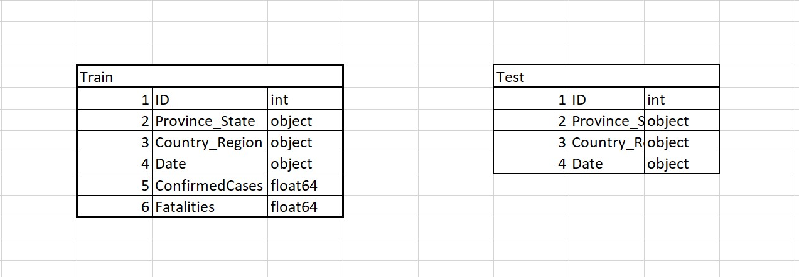

# Covid-19
## Objective
This project is aimed at arriving at accurate forecast for the confirmed cases and fatalities of COVID-19 between April 02 and May 14. This work is inspired by Kaggle competition named COVID-19 Global Forecasting(Week 4). This result will provide the basis for answering the set of questions posted by WHO about the transmission rate and the factors impacting them (which is not dealt in this project). To achieve the outlined objective, a time series model using XGBoost and LSTM to predict the Confirmed Cases and Fatalities is built.

## Dataset

Two datasets (train.csv and test.csv) from Kaggle are employed in this project. Link to access the datasets - https://www.kaggle.com/c/covid19-global-forecasting-week-4/data

Data schema is laid out below:

The Train data set, containing 35,650 rows, is used as a basis to predict the confirmed cases and fatalities. This details of the number of confirmed cases and fatalities in each state specific to its respective country on a particular date between January to April. The features that describe these details are Country_Region, Province_State, Date, ConfirmedCases and Fatalities. 
The Test data set, containing 13,459 rows, has the same set of countries and states with the date range for which the confirmed cases and fatalities are to be predicted, which is April to May. This file has the same features as the Train data except the ConfirmedCases and Fatalities since they are yet to be predicted.

## Visualization
### Global increase in COVID-19 cases and fatalities over time
To better understand the increase in cases and fatalities, the data in the Train data set is represented using a bar chart where the blue bar represents the confirmed cases and red the fatalities. It is evident from the graph that both the numbers have been exponentially increasing since January. This visualisation helps us to see the increase of global increases in cases and fatalities over time.

### COVID-19 confirmed cases and death by Country
The below visualisation depicts the increase in cases and deaths in every country. To easily visualise the intensity of the impact, the countries with the greatest number of cases and deaths are shown in red. The intensity of the shade is directly correlated with the intensity of the cases and deaths. The visualisation is dynamic and shows the increasing/decreasing cases and deaths in each country with time. This can be viewed by the color intensity, for example, from March 10 the change of color in United States will be more pronounced as the country saw an exponential growth of cases and deaths since then. Similarly, the decrease in number of cases and deaths in China can be clearly visualised by the decrease in intensity of the red color in that region. The precise numbers can also be viewed with the help of the legend on the side of the graph. This legend helps with relation between the number of cases and deaths and the associated color. 
Reference for the code for the visualisation can be found https://opensource.com/article/20/4/python-map-covid-19

## Modelling
### XGBOOST Algorithm
Boosting is a sequential technique which combines the predictions from multiple decision tree to generate an ensemble tree. It delivers a revamped accuracy by combining the set of weak learners from other trees. So, the corrected predicted outputs from each tree are given a lower weight and irrelevant outputs are higher weighted.  The final ensembles tree concludes with important features and parameters to build better model and exploit the misclassification errors from other model and try to reduce the errors. XGBoost is preferred owing to its speed and performance, also it has multiple parameters that enable us to tune them and obtain better results. Before building the model, new features from raw data was extracted to improve the performance of algorithm. The model was then fine tuned with GridSearchCV function, using different values of max depth, Learning rate and No. of Estimators as tuning parameters. After which trained XGBoost model was used to predict the confirmed cases and fatalities.

### LSTM (Long Short-Term Memory)
LSTM is a category of  Recurrent Neural Network(RNN).  RNN works well when it deals with short-term dependencies, but RNN does not grasp the context of input. If the dataset is loaded with huge amount of  irrelevant data , RNN fails to remember the important information of data after short duration of time. This particular problem is called Vanishing Gradient. To overcome the Vanishing Gradient problem LSTM can be used. LSTM architecture is built in such a way that it can store information or forget information using cell states when the information flow through network. With the help of cell states, LSTM can make small modifications to the input by selectively remember things which is important under the context and forget the information which is irrelevant using forget gate. LSTM is generally used for sequence prediction problem by extracting past observations to predict the next value. It would be ideal for Time Series Forecasting. LSTM model requires the input variables to be normalized, converted to supervised learning and reshaped into three-Dimensional Data. Once this is achieved, prediction can be successfully achieved. 

## Evaluation/Result

The models XGBoost and LSTM are evaluated using RMSE (Root Mean Square Error) metric. Since the test data does not contain the target variables such as ConfirmedCases and Fatalities, the train data set had to be split to evaluate the predicted result. 
#### RMSE evaluation for Cases
RMSE for LSTM: 0.016

RMSE for XGBoost: 3762.27
#### RMSE evaluation for Fatalities
RMSE for LSTM: 0.011

RMSE for XGBoost: 247.45

Based on the metric evaluation, it is evident that LSTM model is better at predicting that confirmed cases and fatalities. High RMSE value denotes that XGBoost requires further hyper parameter tuning for reliable results. 

## Comparing Actual vs Predicted Values

Comparing the Actual Confirmed Cases with Predicted Cases. LSTM predicts the values perfectly as same as actual value. 
